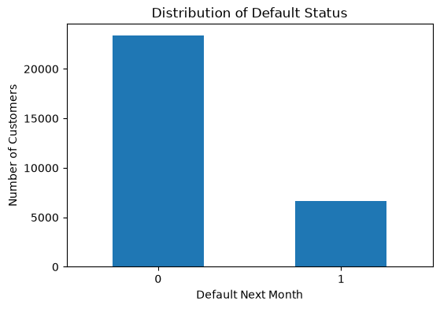
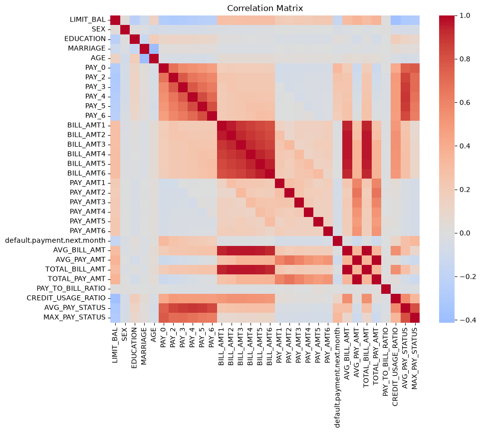
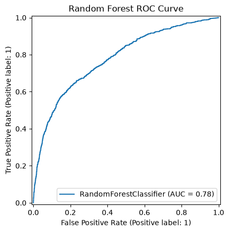
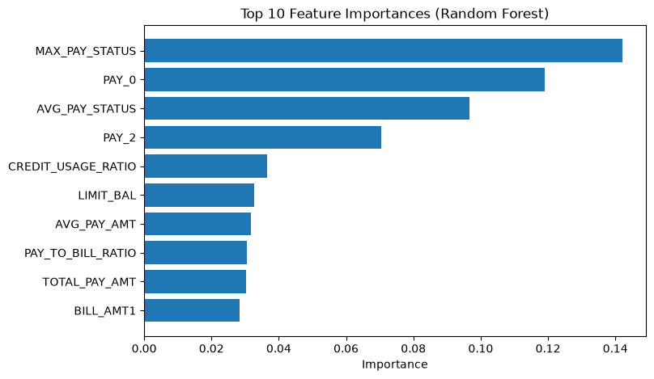
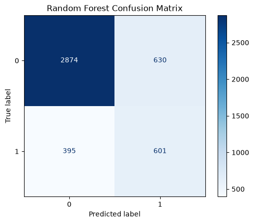

# Credit Default Prediction

Machine learning project for predicting credit card default risk using Python and Scikit-learn.

---

## Overview

This project predicts whether a credit card customer will default or not on their next payment using machine learning classification models. The project uses the UCI Default of Credit Card Clients dataset and it compares multiple models, including Logistic Regression, Random Forest, Support Vector Machine, and Gradient Boosting.

---

## My Contributions

This project was completed as part of CFRM 521 at the University of Washington in a four-person team.

My contributions:

- Data cleaning and preprocessing
- Feature engineering
- Exploratory Data Analysis (EDA)
- Logistic Regression implementation
- Hyperparameter tuning
- Model evaluation and interpretation

---

## Dataset

- **Source:** UCI Machine Learning Repository
- **Observations:** 30,000 credit card clients
- **Target Variable:** `default.payment.next.month`

License: Creative Commons Attribution 4.0 International (CC BY 4.0)

https://archive.ics.uci.edu/dataset/350/default+of+credit+card+clients

---

## Technologies

- Python
- Pandas
- NumPy
- Scikit-learn
- Matplotlib
- Seaborn
- Jupyter Notebook

---

## Workflow

- Data Cleaning
- Outlier Treatment
- Feature Engineering
- Exploratory Data Analysis
- Train / Validation / Test Split
- Feature Scaling
- Model Training
- Hyperparameter Tuning
- Model Evaluation

---

## Machine Learning Models

- Logistic Regression
- Random Forest
- Support Vector Machine (SVM)
- Gradient Boosting

---

## Results

| Model | Accuracy | F1 Score | ROC-AUC |
|:------|---------:|---------:|---------:|
| Logistic Regression | 0.7216 | 0.5119 | 0.7401 |
| **Random Forest** | **0.7870** | **0.5380** | **0.7760** |
| Support Vector Machine | 0.7551 | 0.5334 | 0.7624 |
| Gradient Boosting | 0.7318 | 0.5103 | 0.7563 |

Random Forest achieved the strongest overall predictive performance.

---

# Visualizations

## Target Variable Distribution



---

## Feature Correlation Matrix



---

## Random Forest ROC Curve



---

## Random Forest Feature Importance



---

## Random Forest Confusion Matrix



---

## Repository Structure

```text
credit-default-prediction/
│
├── credit_default_prediction.ipynb
├── data/
│   └── UCI_Credit_Card.csv
├── figures/
│   ├── correlation_heatmap.png
│   ├── confusion_matrix.png
│   ├── default_distribution.png
│   ├── feature_importance.png
│   └── ROC_curve.png
└── README.md
```

---

## How to Run

1. Clone this repository.
2. Install the required Python libraries.
3. Open `credit_default_prediction.ipynb`.
4. Run all notebook cells.

---

## Acknowledgements

This project was completed for **CFRM 521: Machine Learning for Finance** at the University of Washington.

Dataset:

Yeh, I. C., & Lien, C. H. (2009). *The comparisons of data mining techniques for the predictive accuracy of probability of default of credit card clients*. Expert Systems with Applications, 36(2), 2473–2480.
